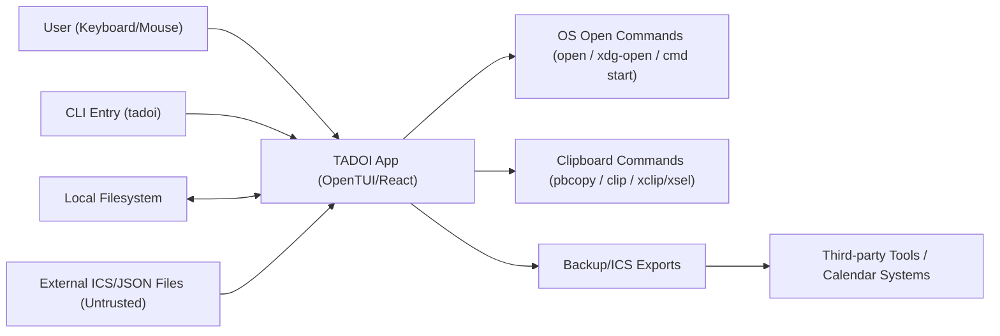

# TADOI Security & Privacy Audit (2026-02-12)

> Archival note (2026-02-13): This is a historical artifact. Path strings were normalized to current repository folder naming for operational consistency. Policy: `docs/ARCHIVAL_PATH_POLICY.md`.

Date: 2026-02-12  
Project: TADOI (`v0.3.4`)  
Repository: `/Users/patrickkazar/Library/CloudStorage/GoogleDrive-pakazar@gmail.com/Other computers/My Computer/Google Drive/CODE PROJECTS/TADOI`

## Executive Summary

TADOI is a local-first terminal application with a relatively small direct network surface, but its import/export and link-opening features create meaningful security and privacy risk boundaries. The highest-impact findings are around untrusted input handling (large import files and imported links), privacy leakage in calendar/export flows, and supply-chain/release hardening gaps.

Finding counts:

- High: 2
- Medium: 7
- Low: 4
- Informational: 1

## Scope

- Runtime code review (TUI, CLI, persistence, import/export, calendar, links, settings).
- Privacy/data lifecycle review (local storage, backup/export, logs).
- Dependency and release pipeline review (package metadata, CI/release workflows, signing scripts).
- No code changes made in this audit.

## Evidence Preflight

Preflight log file:

- `/Users/patrickkazar/Library/CloudStorage/GoogleDrive-pakazar@gmail.com/Other computers/My Computer/Google Drive/CODE PROJECTS/TADOI/docs/audits/logs/preflight-2026-02-12.txt`

Captured run window:

- Start (local): 2026-02-12 01:34:36 CST
- Start (UTC): 2026-02-12T07:34:36Z
- End (local): 2026-02-12 01:34:39 CST
- End (UTC): 2026-02-12T07:34:39Z

Command results:

- `bun audit`: exit `1`, `1 vulnerabilities (1 low)` (`diff` advisory GHSA-73rr-hh4g-fpgx).
- `bun run test`: exit `0`, `378 pass / 0 fail`.
- `bun run typecheck`: exit `2`, TypeScript errors in calendar import/export test and service typing.

## Architecture and Trust Boundaries

Trust zones:

- Trusted runtime state: in-memory task/settings state.
- Semi-trusted local files: existing persisted data/settings.
- Untrusted inbound content: imported JSON and ICS files, imported links, calendar metadata.
- External execution boundary: spawned OS open/clipboard commands.
- External distribution boundary: CI/release workflows and artifact signing.

## Runtime Attack Surface

- File ingestion:
- JSON import: `src/state/backupService.ts:254`
- ICS import: `src/state/calendarImportService.ts:398`
- Link opening:
- Scheme policy and allowlist: `src/domain/taskLinks.ts:3`
- OS command execution: `src/app/openTarget.ts:41`
- Confirm UX path for non-allowlisted schemes: `src/app/App.tsx:3518`
- Persistence writes:
- Atomic write implementation: `src/state/persistence.ts:379`
- Export privacy surfaces:
- ICS description assembly from notes/tags/links: `src/calendar/calendarMapper.ts:117`
- Backup redaction behavior: `src/state/portability.ts:474`

## Privacy and Data Lifecycle

- Data persisted in plaintext JSON/settings under user directories.
- Backup and corrupt snapshots are automatically generated in adjacent directories.
- Startup logs include absolute user data/settings paths (`src/tui/runTui.tsx:23`).
- Calendar and backup exports can include sensitive task metadata.

## Findings (Ranked)

## High

### SEC-001: Unbounded import file size enables memory/CPU denial of service

- Severity: High
- Affected area: JSON and ICS import pipelines
- Evidence:
- JSON import reads entire file into memory before parse (`src/state/backupService.ts:258`).
- ICS import reads entire file into memory before parse (`src/state/calendarImportService.ts:400`).
- No maximum file size guard before parse.
- Exploit narrative:
- A user imports a very large or intentionally malformed file from an untrusted source.
- The process attempts full in-memory load/parse and can exhaust memory or become unresponsive.
- Impact:
- Availability loss (hang/crash), potential interrupted workflows and partial state operations.

### PRIV-001: ICS export leaks notes/tags/links by default

- Severity: High
- Affected area: Calendar export privacy
- Evidence:
- Export description includes notes (`src/calendar/calendarMapper.ts:119`).
- Export description includes tags (`src/calendar/calendarMapper.ts:124`).
- Export description includes link labels and targets (`src/calendar/calendarMapper.ts:129`).
- First HTTP link is exported to `URL` field (`src/calendar/calendarMapper.ts:137`).
- Exploit narrative:
- Users share an `.ics` file expecting scheduling metadata only.
- Export contains internal notes, tags, and links that may include private context.
- Impact:
- Direct confidentiality leak to calendar consumers or third-party systems.

## Medium

### SEC-002: Imported links can trigger local file/path execution flows with limited friction

- Severity: Medium
- Affected area: Link import + link open
- Evidence:
- ICS description parser accepts `file:` and filesystem-like path targets (`src/calendar/importMapper.ts:106`).
- Link scheme allowlist includes `file` as non-confirmed (`src/domain/taskLinks.ts:3` and `src/domain/taskLinks.ts:31`).
- Open action calls OS open command directly once allowed (`src/app/App.tsx:3531`, `src/app/openTarget.ts:41`).
- Exploit narrative:
- Untrusted ICS import plants links that resolve to local files/executables.
- User opens link from details pane; OS handler executes/open behavior.
- Impact:
- Potential unsafe local execution or exposure through social-engineered link opens.

### SEC-003: Windows open implementation relies on `cmd /c start` with untrusted target input

- Severity: Medium
- Affected area: Windows command invocation
- Evidence:
- Windows path uses `cmd` with `["/c", "start", "", target]` (`src/app/openTarget.ts:41`).
- Exploit narrative:
- Special characters and shell parsing quirks in `cmd.exe` can create behavior ambiguity.
- While input is argumentized, `cmd` remains a shell boundary and increases risk relative to direct system APIs.
- Impact:
- Elevated command-parsing risk and unexpected open behavior on Windows.

### PRIV-002: Backup redaction mode is partial and may create false privacy expectations

- Severity: Medium
- Affected area: Portable backup export
- Evidence:
- Redaction blanks only `title` and `notes` (`src/state/portability.ts:474`).
- Tags, links, due dates, recurrence metadata, and settings remain in export payload.
- Exploit narrative:
- Users may rely on `--redact` for broad sharing safety, but sensitive metadata persists.
- Impact:
- Metadata leakage (categories, relationships, schedules, references) despite “redacted” export.

### SCM-001: Floating `latest` dependencies reduce build determinism and increase supply-chain risk

- Severity: Medium
- Affected area: Dependency management
- Evidence:
- `@opentui/core` and `@opentui/react` specified as `"latest"` (`package.json:44` and `package.json:45`).
- Exploit narrative:
- Fresh installs can resolve to new versions outside explicit review cadence.
- Unexpected behavior or compromised upstream releases can be introduced.
- Impact:
- Integrity and reproducibility risk for development and release builds.

### REL-001: GitHub Actions are tag-pinned, not commit-SHA pinned

- Severity: Medium
- Affected area: CI/CD hardening
- Evidence:
- Examples: `actions/checkout@v4`, `oven-sh/setup-bun@v2`, `softprops/action-gh-release@v2`
  (`.github/workflows/ci.yml:25`, `.github/workflows/release.yml:31`, `.github/workflows/release.yml:131`).
- Exploit narrative:
- Upstream action tag movement or supply-chain compromise can affect pipeline behavior.
- Impact:
- Pipeline integrity risk and reduced provenance guarantees.

### REL-002: Signing scripts allow silent “skip” success when signing secrets are absent

- Severity: Medium
- Affected area: Artifact trust and release policy
- Evidence:
- macOS signing/notarization exits `0` when env vars are missing (`packaging/macos/sign-notarize.sh:37`).
- Windows signing exits `0` when cert vars are missing (`packaging/windows/sign.ps1:15`).
- Exploit narrative:
- Release flow can continue without signed artifacts if secrets are not configured.
- Impact:
- Distribution trust degradation and downstream verification gaps.

### REL-003: Local quality gate drift (typecheck failing while release flow expects pass)

- Severity: Medium
- Affected area: Release confidence
- Evidence:
- Typecheck command configured as required gate (`package.json:23`, `.github/workflows/release.yml:44`).
- Current captured run shows `bun run typecheck` exit `2` (preflight log).
- Exploit narrative:
- Branch-level drift can undermine release confidence and hide regressions.
- Impact:
- Reduced assurance of runtime correctness and release readiness.

## Low

### PRIV-003: Startup logs expose absolute user filesystem paths

- Severity: Low
- Affected area: Operational privacy
- Evidence:
- Data and settings paths logged at startup (`src/tui/runTui.tsx:23` and `src/tui/runTui.tsx:24`).
- Exploit narrative:
- Screen recordings/shared logs reveal username/system path details.
- Impact:
- Minor but avoidable environmental information disclosure.

### SEC-004: Atomic write uses predictable `.tmp` sibling path without stronger local-hardening controls

- Severity: Low
- Affected area: Persistence integrity
- Evidence:
- Temporary file path is deterministic `filePath + ".tmp"` (`src/state/persistence.ts:387`).
- No explicit fsync or unique temp file token before rename.
- Exploit narrative:
- On shared/multi-user environments with local filesystem manipulation, predictable temp naming raises race/symlink concerns.
- Impact:
- Low-probability local integrity risk.

### PRIV-004: Settings read errors are silently swallowed, reducing operator visibility

- Severity: Low
- Affected area: Configuration safety/diagnostics
- Evidence:
- `readSettingsFile` catches all errors and returns `null` (`src/settings/settings.ts:380`).
- Fallback to defaults/alternate path proceeds without warning (`src/settings/settings.ts:400`).
- Exploit narrative:
- Corrupt settings can go unnoticed; users may run with unexpected defaults.
- Impact:
- Configuration reliability and troubleshooting risk; limited direct security impact.

### SCM-002: Known low-severity vulnerable transitive dependency present in lock state

- Severity: Low
- Affected area: Transitive dependency posture
- Evidence:
- `bun audit` reports `diff >=6.0.0 <8.0.3` low DoS advisory via `@opentui/core` (preflight log).
- Impact:
- Low immediate risk, but should be tracked and remediated.

## Informational

### INFO-001: Positive controls already in place

- Severity: Informational
- Evidence:
- Strict persisted-state validation and migrations (`src/state/validation.ts`, `src/state/persistence.ts`).
- External-scheme confirmation for non-allowlisted URL schemes (`src/app/App.tsx:3518`).
- Recurrence materialization hard cap exists (`src/state/calendarImportService.ts:32`).
- Tests are broad and currently passing (`bun run test` preflight result).

## Release and Supply-Chain Observations

- CI and release workflows perform tests, typecheck, and packaging checks, which is a strong baseline.
- Hardening gaps remain around action pinning, signing enforcement, and dependency pin discipline.

## Conclusion

TADOI’s primary risk profile is not remote-network compromise; it is local trust-boundary misuse (imports and link opens), privacy leakage through export defaults, and distribution integrity weaknesses in release hygiene. Addressing the high and medium findings will materially improve both user safety and release trust without major architectural change.
